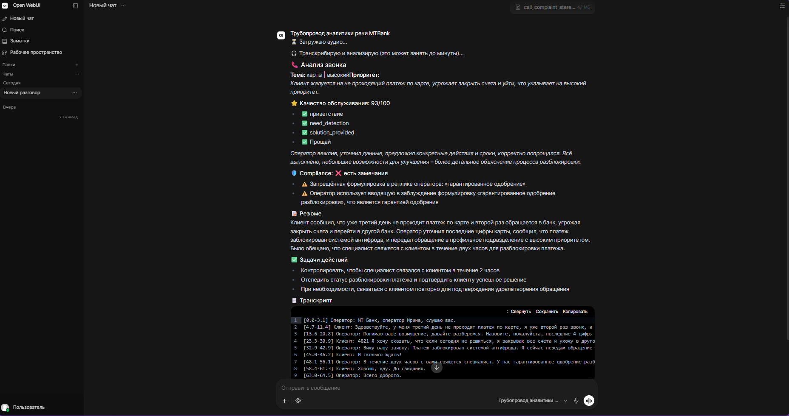
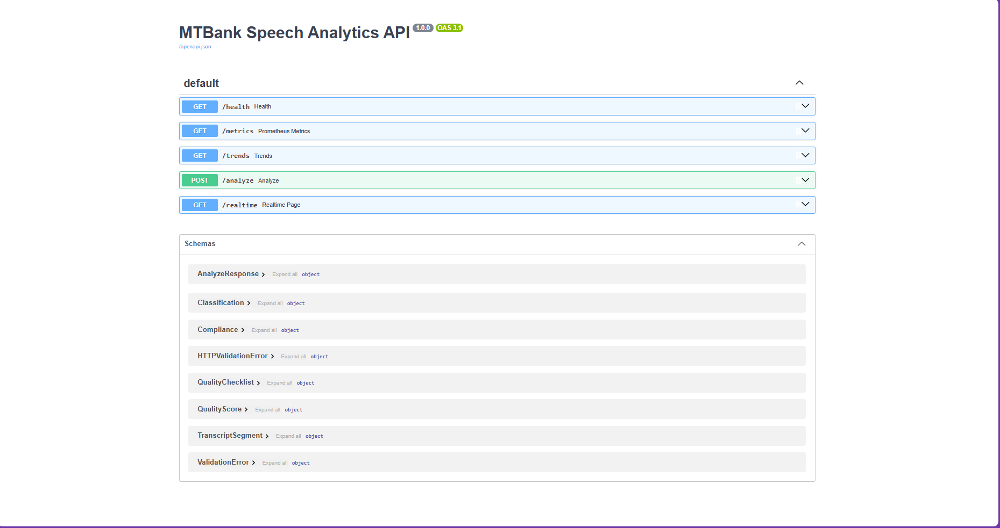
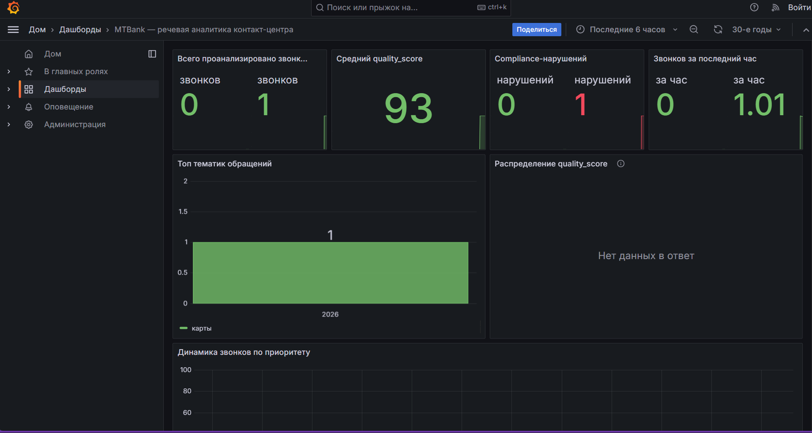
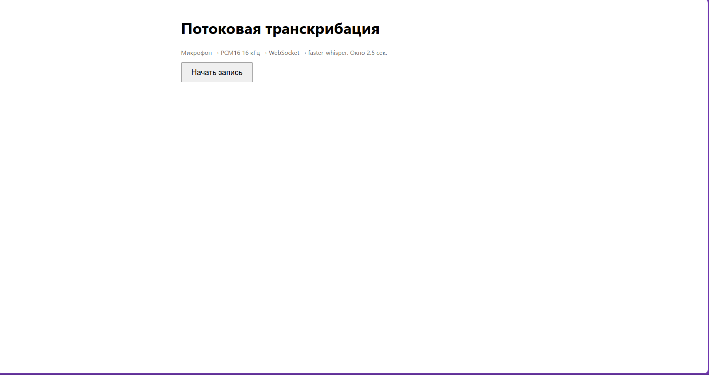

# 🏦 MTBank Speech Analytics — тестовое задание AI Engineer

Прототип речевой аналитики контакт-центра: ASR-транскрибация → диаризация →
4 LLM-агента → отчёт в чате OpenWebUI и REST API.

---

## Содержание

- [Архитектура](#архитектура)
- [Архитектурные решения](#архитектурные-решения)
- [Быстрый старт](#быстрый-старт)
- [Живое демо](#живое-демо)
- [REST API](#rest-api)
- [Бонусные задания](#бонусные-задания)
- [Тесты](#тесты)
- [Тестовые данные и WER](#тестовые-данные-и-wer)
- [Известные ограничения](#известные-ограничения)
- [Структура репозитория](#структура-репозитория)

---

## Архитектура

```
                        ┌──────────────────────┐
   Аудио (чат/URL/API)  │   Pipeline.pipe()    │◄──── REST /analyze (FastAPI)
   ───────────────────► │   / Pipeline.analyze()│
                        └──────────┬───────────┘
                                   │
                     ┌─────────────┴─────────────┐
              ┌──────▼──────┐            ┌───────▼──────────┐
              │ Transcriber │───────────►│    Diarizer      │
              │(faster-     │            │ стерео-каналы /  │
              │ whisper)    │            │ pyannote / паузы │
              └─────────────┘            └───────┬──────────┘
                                                 │
                                transcript: [{speaker,start,end,text}]
                                                 │
               ┌───────────────┬─────────────────┼─────────────────┐
      ┌────────▼───────┐ ┌─────▼────────┐ ┌──────▼───────┐ ┌───────▼──────┐
      │ Классификатор  │ │Агент качества│ │  Compliance  │ │ Суммаризатор │
      │ тема/приоритет │ │ чеклист+балл │ │ правила+LLM  │ │резюме+actions│
      └────────┬───────┘ └─────┬────────┘ └──────┬───────┘ └───────┬──────┘
               └───────────────┴─────────────────┴─────────────────┘
                  AgentOrchestrator.run_all() — asyncio.gather, параллельно
                                                 │
                                  JSON-ответ / markdown-отчёт в чат
```

Класс `Pipeline` в `pipeline.py` служит единой точкой правды. И чат
(`pipe()`), и REST (`api/main.py` → `pipeline.analyze()`) зовут один и тот же
`analyze()`, поэтому поведение не расходится.

Представление при этом разное, и это намеренно. JSON `/analyze` отдаёт схему
из ТЗ буква в букву. Отчёт в чате мы форматируем по-своему: подряд идущие
реплики одного говорящего склеиваем, а к теме и оценке добавляем обоснования
агентов (`reasoning`, `comment`). Именно они объясняют супервайзеру, откуда
взялась оценка. В схеме ТЗ таких полей нет, поэтому в JSON они не попадают.

---

## Архитектурные решения

**1. Оркестрация: собственный Supervisor, без LangGraph.** Четыре агента
читают один и тот же транскрипт и не зависят от выходов друг друга, графа
зависимостей между ними не возникает. `asyncio.gather(..., return_exceptions=True)`
запускает их параллельно и переживает частичный отказ, не притаскивая лишнюю
зависимость. LangGraph окупился бы при ветвлении, циклах или условных
переходах. Здесь их нет. Подробнее объясняет докстринг
`agents/orchestrator.py`.

**2. LLM: любая OpenAI-совместимая модель через один клиент**
(`agents/llm_client.py`), настраивается через `.env`
(`LLM_BASE_URL` / `LLM_API_KEY` / `LLM_MODEL`). По умолчанию стоит Groq:
бесплатный tier, `openai/gpt-oss-120b`, быстрый инференс. Together, OpenRouter,
локальный vLLM или Ollama подключаются переключением одной переменной, код
агентов при этом не меняется. Запросы уходят с `response_format=json_object` и
`temperature=0`, ретраи держит `tenacity`: три попытки и только на то, что
может пройти со второй, то есть 429, 5xx, сетевые сбои и невалидный JSON.
Повторять 401 или 400 бессмысленно.

**3. Диаризация: три стратегии, выбор автоматический.** Приоритет отдаём
разделению по стерео-каналам. Для контакт-центра это типичный формат записи, а
канал жёстко равен говорящему, что точнее любой модели и обходится бесплатно.
Моно разбираем иначе: при заданном `HF_TOKEN` работает `pyannote.audio`
(кластеризация по голосу), без него включается резервная эвристика по паузам в
аудио. Если pyannote спотыкается на файле, режим `auto` тихо откатывается на
эвристику. При явном `DIARIZATION_BACKEND=pyannote` пайплайн вместо этого
падает с ошибкой: явный выбор никогда не подменяется молча.

**4. Compliance: гибрид правил и LLM.** ТЗ требует трёх вещей: запрещённые
фразы, обязательные disclaimers, корректность предложений.

- **Запрещённые формулировки** ищем детерминированным поиском по подстроке,
  это даёт 100% recall на точных фразах. Смотрим только реплики оператора:
  клиент, сказавший «мне обещали гарантированное одобрение», создаёт не
  нарушение, а повод разобраться.
- **Обязательные раскрытия** тоже проверяем правилом и привязываем к теме. В
  кредитном звонке должны прозвучать «решение принимает банк», полная ставка и
  оговорка про оферту. Где заходит речь о страховании, проверяем его
  добровольность. В звонке про блокировку карты ничего из этого не требуется.
- **Тонкие нарушения** (давление, грубость, некорректная подача условий)
  отдаём LLM, правилом их не выразить.

То, что можно проверить правилом, мы проверяем правилом. Так это устроено и в
реальном комплаенсе.

**5. Отказ агента не равен результату проверки.** У упавшего агента значений
нет, а `None` в булевом контексте ложен, поэтому недоступность LLM выглядела бы
как «❌ есть замечания по compliance». Для банка это худший режим отказа:
супервайзер видит нарушение там, где отвалился сервис. Поэтому отказ отделён
явно. В ответе появляется ключ `errors` (только при деградации), в чате
печатается «данные недоступны», а `/analyze` отдаёт 502, если не отработал ни
один агент. Деградированный анализ не пишется ни в историю, ни в метрики.

**6. Tools/Actions не реализованы, и вот почему.** Термины из критерия взяты
из терминологии OpenWebUI: `Tools` обозначают функции, которые модель зовёт по
ходу разговора, `Actions` — кнопки под сообщением. Сценарий ТЗ «прикрепил
аудио → получил отчёт» решается одним `pipe()`: ветвления нет, модель не
выбирает инструмент. Единственная функция вне этого сценария, тренды по
последним звонкам, сделана текстовой командой (`тренды` в чате) и эндпоинтом
`GET /trends`, а такой вариант работает в любой версии OpenWebUI. ТЗ разрешает
отклониться с обоснованием, это оно.

**7. Valves без секретов.** `LLM_BASE_URL`, `LLM_MODEL`, `WHISPER_MODEL` и
`WHISPER_DEVICE` правятся из админки, а `on_valves_updated()` пересобирает
`Transcriber` и `LLMClient` без перезапуска контейнера. `LLM_API_KEY` в валвы
не попал намеренно: сервер Pipelines объявляет `GET /{id}/valves` и
`POST /{id}/valves/update` без аутентификации, так что всё, что туда попало,
читается и переписывается по HTTP. Ключ берём только из окружения, порт 9099
наружу не публикуем.

**8. Вложение чата читаем с диска, а не по HTTP.**
`/api/v1/files/{id}/content` у OpenWebUI 0.11 требует авторизацию даже при
`WEBUI_AUTH=false`, и главный сценарий ТЗ падал на 401. Требовать от
проверяющего выпустить API-ключ руками противоречит условию «`docker compose up`
поднимает весь стек», поэтому том вложений монтируется в `pipelines` только на
чтение, а файл ищется по id. HTTP остался запасным путём для облака, где
сервисы не делят диск.

---

## Как это выглядит


*Прикреплённый аудиофайл и готовый отчёт с оценкой качества, compliance и транскриптом*

---

## Быстрый старт

```bash
git clone <адрес-репозитория>
cd mtbank-ai-hiring
cp .env.example .env      # впишите LLM_API_KEY
docker compose up --build
```

После старта:

| Сервис | Адрес |
|---|---|
| Чат OpenWebUI — главный сценарий | http://localhost:3000 |
| REST API, Swagger | http://localhost:8080/docs |
| Grafana (бонус) | http://localhost:3001 |
| Потоковая транскрибация (бонус) | http://localhost:8080/realtime |

В чате выберите модель `MTBank Speech Analytics Pipeline` и прикрепите аудио.
Первый старт OpenWebUI занимает несколько минут: он тянет embedding-модель
своего встроенного RAG.

Все порты опубликованы на `127.0.0.1`. Для `9099` это принципиально, потому
что маршруты валвов у сервера Pipelines объявлены без аутентификации
(решение 7).

Шаг `cp .env.example .env` можно пропустить: значения имеют дефолты в
`config.py`, а `env_file` помечен необязательным. `.env` нужен ради
`LLM_API_KEY`, без него агенты не смогут обратиться к LLM.

Диаризация по голосу собирается отдельно, потому что тянет torch:

```bash
docker compose build --build-arg WITH_PYANNOTE=true   # плюс HF_TOKEN в .env
```

Сервис `openwebui-provision` в компоузе поднимается разово и после старта
выключает у модели пайплайна встроенный RAG. Без него любое вложение уходит в
RAG-эмбеддинг, и до пайплайна доезжает не файл, а текстовая выжимка: анализ не
запускается вовсе. Настройка живёт в базе OpenWebUI, из compose её выставить
нельзя, только запросом к API после старта.

### Запуск без Docker

```bash
python -m venv venv && source venv/bin/activate
pip install -r requirements.txt -r requirements-dev.txt
cp .env.example .env
uvicorn api.main:app --reload --port 8080
```

---

## Живое демо

| Что | Адрес |
|---|---|
| Чат OpenWebUI — главный сценарий | `https://104-155-85-230.sslip.io/` |
| REST API, Swagger | `https://104-155-85-230.sslip.io/docs` |
| Потоковая транскрибация (бонус) | `https://104-155-85-230.sslip.io/realtime` |
| Grafana-дашборд (бонус) | `https://104-155-85-230.sslip.io/grafana/dashboards` |

Демо разворачивается на обычной Linux-VM тем же `docker compose`, оверлеем
[`docker-compose.prod.yml`](docker-compose.prod.yml): он добавляет Caddy
(HTTPS от Let's Encrypt автоматически) и ставит `WHISPER_MODEL=medium`.
Порядок и скрипт [`scripts/deploy_vm.sh`](scripts/deploy_vm.sh) описывает
[`docs/deployment.md`](docs/deployment.md), там же лежат альтернативы Render и
RunPod.

VM выбрана не из экономии. На ней работают все шесть сервисов, включая
бонусные Prometheus и Grafana, которые PaaS-варианты вынуждены выбрасывать.

**Честно про время отклика.** Требование «<60 сек на файл до 5 минут»
относится к критерию «Живое демо», а «модель `medium` или выше» к критерию
ASR. На CPU выполнить оба сразу нельзя, и мы выбрали модель. Замер на 4 vCPU:
**запись 66 секунд обрабатывается за 478 секунд**, то есть RTF около 7. Пять
минут аудио на этом железе заняли бы больше получаса. Всё время съедает
транскрибация, четыре агента отрабатывают за 5.7 секунды. Настоящее
«<60 сек» достижимо только на GPU (раздел RunPod в `docs/deployment.md`).

---

## REST API

```
POST /analyze
Content-Type: multipart/form-data
Body: file=<audio.wav|mp3|ogg>

# или

POST /analyze
Content-Type: application/json
Body: {"url": "https://example.com/call.wav"}
```


*Интерактивная документация API на /docs*

В ответ приходит JSON строго по схеме задания:

```json
{
  "transcript": [
    {"speaker": "Оператор", "start": 0.0, "end": 4.2, "text": "Добрый день, МТБанк..."}
  ],
  "classification": {"topic": "кредиты", "priority": "medium"},
  "quality_score": {
    "total": 78,
    "checklist": {"greeting": true, "need_detection": true, "solution_provided": true, "farewell": false}
  },
  "compliance": {"passed": true, "issues": []},
  "summary": "Клиент обратился по вопросу условий кредита наличными...",
  "action_items": ["Отправить инструкцию по заявке на email клиента"]
}
```

Схема описана в OpenAPI, поэтому на `/docs` эндпоинт вызывается кнопкой
«Try it out», причём оба варианта тела.

**Коды ответа.** `400` возвращается, когда файл не распознан как аудио, формат
не поддержан, превышена длительность или в записи нет речи. `502` означает,
что не отработал ни один агент (транскрипт в теле при этом остаётся). При
частичном отказе приходит `200` и дополнительный ключ `errors`. На успешном
пути его нет, и схема совпадает с ТЗ.

Прочие эндпоинты: `GET /health`, `GET /trends?last=20` (бонус),
`GET /metrics` (бонус), `WS /ws/transcribe` (бонус).

---

## Бонусные задания

| Бонус | Статус | Где смотреть |
|---|---|---|
| Агент трендов (+5) | ✅ | [`agents/trends.py`](agents/trends.py), `GET /trends`, команда `тренды` в чате |
| Grafana-дашборд (+5) | ✅ | [`deploy/grafana/`](deploy/grafana/), порт `3001`, датасорс и дашборд провижинятся сами |
| Real-time WebSocket (+5) | ⚠️ реализован, порог не выдержан | [`realtime.py`](realtime.py), `WS /ws/transcribe`, страница `GET /realtime` |


*Дашборд с метриками пайплайна*


*WS /ws/transcribe — потоковая транскрибация в браузере*

Агент трендов работает со сводками нескольких звонков из `storage.py`, а не с
одним транскриптом, поэтому он не проходит через `AgentOrchestrator`. В
потоковом режиме запускается только транскрибация: диаризации и агентам нужен
разговор целиком, а не окно в 2.5 секунды.

Задержка окна `WS /ws/transcribe` на CPU держится около 3.8 сек при требовании
«<3 сек». Порог мы не выдержали, и здесь это отмечено, а не спрятано. На GPU
цель достижима.

---

## Тесты

```bash
pip install -r requirements.txt -r requirements-dev.txt
pytest -v
```

Или в образе, без локального окружения:

```bash
docker compose build --build-arg WITH_DEV=true && docker compose run --rm api pytest -q
```

**165 тестов, проходят за секунды.** Все обращения к LLM и ASR замоканы, так
что сеть, ключи и GPU не нужны. `pyannote.audio` тоже не нужен, он
импортируется лениво.

- `tests/test_agents.py` — unit-тесты каждого из 4 агентов: fallback
  классификатора, валидация оценки качества (отсутствие `total` считается
  ошибкой, а не нулём), правила compliance, повтор запроса суммаризатора,
  когда резюме выходит за 3–5 предложений.
- `tests/test_pipeline.py` — интеграционные, включая сквозной прогон
  настоящего `analyze()` с подменёнными ASR и LLM: схема ответа, деградация при
  отказе агента, ASR вне event loop, отказ на тишине, отсутствие секретов в
  валвах.
- `tests/test_api.py` — контракт `POST /analyze` (multipart и JSON), коды 400
  и 502, схемы в OpenAPI.
- `tests/test_diarizer.py` — все три стратегии и автовыбор между ними.
- Остальное: транскрайбер, JSON-логи агентов, SQLite-хранилище, агент трендов,
  Prometheus-метрики, потоковое окно, провижининг, нормализация WER,
  санитайзинг `HF_TOKEN`.

Полный прогон реального аудио через faster-whisper в pytest мы намеренно не
делаем, для этого есть `scripts/run_wer_eval.py`.

---

## Тестовые данные и WER

`test_data/generate_test_data.py` генерирует аудио из сценария
`docs/sample-dialog.md` через **edge-tts** (голоса `ru-RU-SvetlanaNeural` для
оператора и `ru-RU-DmitryNeural` для клиента).

| Файл | Длит. | Особенность |
|---|---|---|
| `call_dialog_stereo.wav` | 145 с | диалог двух говорящих, стерео (L=Оператор, R=Клиент) |
| `call_dialog_mono.wav` | 145 с | тот же диалог в моно — проверка эвристики |
| `call_dialog_8khz.wav` | 145 с | 8 кГц / pcm_mulaw — телефонное качество |
| `call_complaint_mono/_stereo.wav` | 66 с | жалоба, высокий приоритет, нарушение compliance |
| `short_*.wav` (6 шт.) | 7–14 с | короткие монологи: кредиты, жалоба, переводы, ипотека, карта, приветствие |
| `short_credit_question.mp3` | 10 с | тот же текст — поддержка **MP3** |
| `short_complaint.ogg` | 14 с | тот же текст — поддержка **OGG** |

Требования ТЗ закрыты каждое: 13 файлов при минимуме в 5, файл 8 кГц, диалог
двух говорящих длиннее минуты, все три формата, общая длительность 10.7 минуты
при требуемых пяти.

Уникальной речи при этом 4.4 минуты: `_stereo`, `_mono`, `_8khz` и варианты
mp3/ogg повторяют одну и ту же запись. Наполнителем они не служат, потому что
доказывают форматы, телефонное качество и две стратегии диаризации на одном
содержании, но и контентом их считать нельзя. Перекос тоже стоит назвать:
шесть из восьми уникальных записей — монологи, то есть диаризация и чеклист
оператора проверяются на двух.

**Эталонные транскрипты** лежат в `*_reference.txt` в формате `Спикер: текст`,
по одному на запись. Соответствие файлов эталонам задаёт `CASES` в
[`scripts/run_wer_eval.py`](scripts/run_wer_eval.py).

### Таблица WER

Прогон `scripts/run_wer_eval.py`, модель `medium`, CPU, `int8`:

| Файл | Длит., с | Слов | WER, % | CER, % |
|---|---|---|---|---|
| `call_dialog_mono.wav` | 145 | 207 | 10.1 | 6.7 |
| `call_dialog_stereo.wav` | 145 | 207 | 10.6 | 6.7 |
| `call_dialog_8khz.wav` | 145 | 207 | 11.1 | 6.8 |
| `call_complaint_mono.wav` | 66 | 101 | 6.9 | 3.7 |
| `short_credit_question.wav` | 10 | 22 | 4.5 | 6.8 |
| `short_complaint.wav` | 14 | 26 | 0.0 | 0.0 |
| `short_transfer_question.wav` | 8 | 22 | 0.0 | 0.0 |
| `short_mortgage_question.wav` | 8 | 18 | 0.0 | 0.0 |
| `short_card_block.wav` | 7 | 19 | 0.0 | 0.0 |
| `short_operator_greeting_variant.wav` | 7 | 18 | 11.1 | 1.0 |
| `short_credit_question.mp3` | 10 | 22 | 4.5 | 6.8 |
| `short_complaint.ogg` | 14 | 26 | 0.0 | 0.0 |

**Средний WER: 4.9%**

MP3 и OGG дают тот же WER, что их WAV-первоисточники: контейнер на точность не
влияет, как и ожидалось. Строка `call_dialog_8khz.wav` показывает деградацию
от телефонного качества при том же содержании, 11.1% против 10.1%. Разница
небольшая, но направление ожидаемое. Синтетическая речь edge-tts вообще даёт
оптимистичную оценку относительно реальных записей: там нет шума линии,
перебиваний и невнятной дикции.

**Оговорка про времена.** Колонку времени мы из таблицы убрали намеренно: она
снималась голым `transcribe()`, тогда как рабочий путь идёт через `diarize()`,
и вдобавок на другой машине. Актуальный замер времени лежит в разделе «Живое
демо» (RTF около 7). Значения WER и CER от способа замера не зависят.

---

## Известные ограничения

- **Моно без `HF_TOKEN`** диаризуется эвристикой по паузам, а не по голосу. Она
  ищет паузы от 1.5 с в самом аудио и изредка путает внутрифразовую паузу TTS
  со сменой говорящего. Стерео-стратегия от этого не страдает.
- **Тестовые данные синтетические**, поэтому WER на реальных телефонных
  записях вырастет.
- **Вердикт compliance не воспроизводится побайтово.** `temperature=0` этого не
  гарантирует: на трёх прогонах одного транскрипта `passed` дал False, True,
  False. Детерминированной остаётся правиловая часть, ровно поэтому она в
  правила и вынесена.
- **Обязательные раскрытия распознаются по формулировкам, а не по смыслу.**
  Оператор, сказавший то же самое своими словами, вызовет ложное срабатывание.
- **В потоковом режиме** нет диаризации и агентов, только транскрибация.
- **SQLite** хватает прототипу, но под нагрузкой реального контакт-центра
  понадобится Postgres.
- **История звонков в поставку не входит** (`data/` в `.gitignore`). После
  `docker compose up` база пустая: агент трендов честно ответит, что данных
  нет, а дашборд покажет нули. Прогоните 3–5 файлов, прежде чем показывать
  бонусы.

---

## Структура репозитория

```
mtbank-ai-hiring/
├── pipeline.py              # OpenWebUI Pipeline — единая точка входа
├── config.py                # pydantic-settings, читает .env
├── storage.py               # SQLite: история анализов
├── metrics.py               # Prometheus-метрики (бонус)
├── realtime.py              # Буферизация потоковой транскрибации (бонус)
├── logging_utils.py         # JSON-логи, включая вход/выход каждого агента
│
├── agents/                  # LLM-агенты
│   ├── base.py              # Базовый класс и утилиты
│   ├── llm_client.py        # OpenAI-совместимый клиент
│   ├── orchestrator.py      # Оркестрация 4 агентов (asyncio.gather)
│   ├── classifier.py        # Агент 1: Тематика + приоритет
│   ├── quality.py           # Агент 2: Чеклист качества
│   ├── compliance.py        # Агент 3: Запреты + обязательные disclaimers
│   ├── summarizer.py        # Агент 4: Резюме + action items
│   └── trends.py            # Агент трендов (бонус)
│
├── asr/                     # Речевые технологии
│   ├── transcriber.py       # faster-whisper обёртка
│   └── diarizer.py          # Диаризация (стерео/pyannote/эвристика)
│
├── api/                     # REST API
│   └── main.py              # FastAPI: /analyze, /trends, /metrics, /ws/transcribe
│
├── docker/                  # Обёртка для сервера OpenWebUI Pipelines
│
├── deploy/                  # Инфраструктура и деплой
│   ├── prometheus.yml       # Конфиг Prometheus
│   ├── Caddyfile            # Реверс-прокси для prod-деплоя
│   └── grafana/             # Провижининг и JSON-дашборды (бонус)
│
├── scripts/                 # Вспомогательные скрипты
│   ├── run_wer_eval.py      # Расчет WER/CER по эталонам
│   ├── provision_openwebui.py # Автонастройка OpenWebUI (отключение RAG)
│   └── deploy_vm.sh         # Скрипт деплоя на Linux-VM
│
├── static/                  # Статика для веб-страниц
│   └── realtime.html        # Демо-страница потокового режима (бонус)
│
├── tests/                   # Тесты (165 шт.)
│   ├── conftest.py          # Общие фикстуры
│   ├── test_agents.py       # Unit-тесты каждого агента
│   ├── test_pipeline.py     # Интеграционные тесты pipeline
│   ├── test_api.py          # Контракт REST API
│   └── test_diarizer.py     # Тесты стратегий диаризации
│
├── test_data/               # Тестовые аудио + эталоны (13 файлов)
│   ├── generate_test_data.py# Генератор аудио через edge-tts
│   ├── call_dialog_stereo.wav
│   ├── call_dialog_mono.wav
│   ├── call_dialog_8khz.wav
│   ├── call_complaint_mono.wav
│   ├── short_complaint.ogg
│   ├── short_credit_question.mp3
│   └── ...                  # + эталонные .txt файлы
│
├── docs/                    # Документация
│   ├── sample-dialog.md     # Сценарий тестового диалога
│   ├── deployment.md        # Инструкция по деплою (Render, RunPod, VM)
│   └── screenshots/         # Демонстрация
│       └── ...
│
├── .env.example             # Пример конфигурации (с подробными комментариями)
├── .dockerignore
├── .gitignore
├── Dockerfile               # FastAPI-сервис
├── Dockerfile.pipelines     # Сервер OpenWebUI Pipelines
├── docker-compose.yml       # Локальный стек: API + Pipelines + OpenWebUI + Grafana
├── docker-compose.prod.yml # Prod-оверлей: Caddy, HTTPS, модель medium
├── docker-compose.gpu.yml   # GPU-оверлей для ускорения ASR
├── render.yaml              # Blueprint для деплоя на Render
├── pytest.ini               # Настройки pytest
├── requirements.txt         # Основные зависимости
├── requirements-dev.txt     # Dev-зависимости (pytest, jiwer, edge-tts)
├── requirements-pyannote.txt # Опц. зависимости для диаризации (torch)
└── README.md                # Полная документация проекта
```
